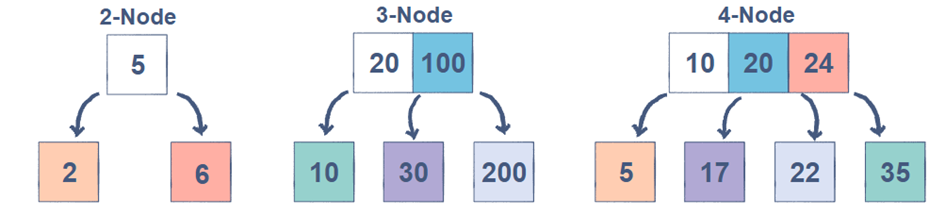
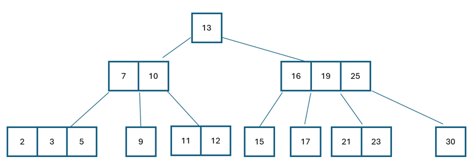
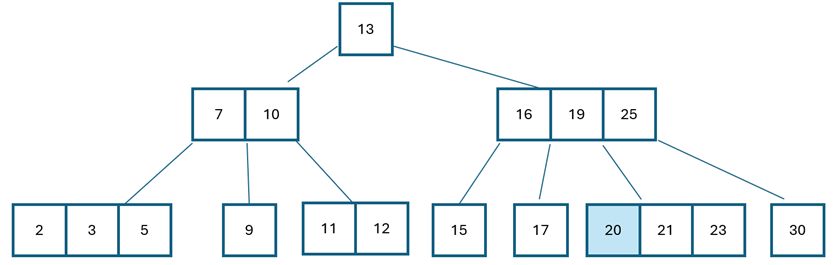
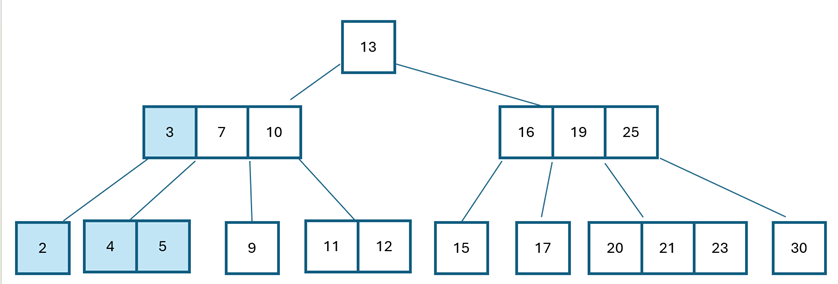
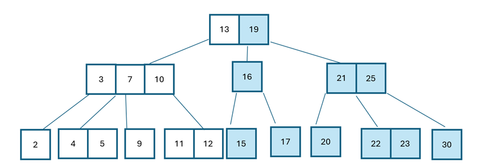
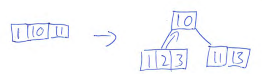
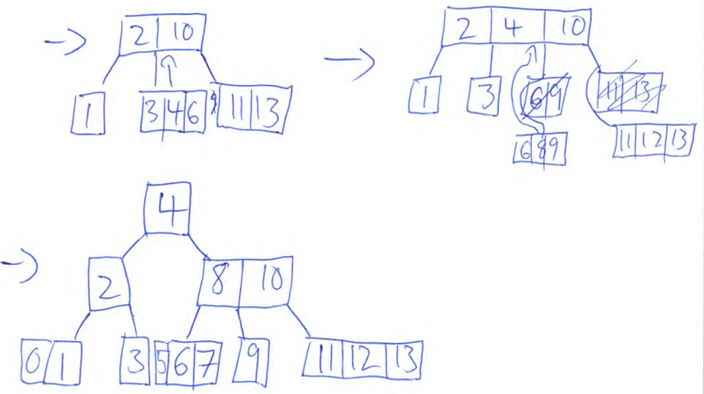

# 2-3-4-trær - B-trær av orden 4
Et selvbalanserende tre, som kan brukes på veien til et rød-sort-tre, et garantert balansert binærtre.
I seg selv er B-trær gode fordi alle bladnoder er på ett nivå, (opptil utrolig mange av dem), 
Når vi traverserer treet i inorden (v, rot, h), besøker vi nodene i stigende rekkefølge.

Fordi treet er balansert, med alle noder på ett nivå er kompleksiteten for søk, innlegging og fjerning O(log n)

Visuelt er det standard å tegne 2-3-4-trær med kvadratiske noder istedenfor runde.

**Regler:**
* Det kan være 1-3 verdier i en node
* En node kan ha 2-4 barn, med mindre den har 0
  * Ett barn er ikke tillatt - derfor kan vi aldri få en linkedlist 
  * Alle bladnoder er på samme nivå - derfor er treet alltid komplett
* Det er *alltid* ett mer barn enn antall verdier i noden:
  * 1 verdi = 2 barn
  * 2 verdier = 3 barn
  * 3 verdier = 4 barn
* Verdiene i en node sorteres fra minst til størst
* Barnenodene er sortert etter størrelse, relatert til foreldrenodens verdier:
  * V-barn er mindre enn den minste verdien i foreldrenoden
  * H-barn er større enn den største verdien i foreldrenoden
  * Barna "i midten" kobles på mellom verdiene, og skal være større enn den minste og mindre enn den største av disse
  * Det er selve verdiene, ikke noden, som har venstre og høyre barn

## Innlegging
1. Vi traverserer og finner en bladnode der verdien kan ligge (størrelsesmessig)
2. Er det plass legger vi verdien direkte inn på rett plass mht de andre verdiene i noden
3. Dersom den er full (3 verdier), skyver vi opp den midterste og legger så inn verdien (andre muligheter er også lov)
   * vi må da omorganisere for å sikre rett antall barn til rett antall verdier

**Tips!** Rydd plass mens du traverserer nedover for å finne hvor en node skal ligge. 
Hver gang du kommer til en node med 3 verdier, skyver du midtverdien opp og omorganiserer. 
Slik vil det alltid være plass i en foreldrenode, dersom bladnoder må skyver verdier oppover.

### Innlegging i node med ledig plass
Vi vil legge inn verdien 20 i treet under: Vi traverserer nedover og finner at det er plass til i noden med verdiene 21 og 23. 
Det kunne være en annen verdi enn 20, men det viktige er at den er større enn foreldrenodens 19 og 25.

Treet før innlegging. 

Treet etter innlegging av 20.

### Innlegging i full node
Vi vil nå legge vi inn i tabellen. Vi traverserer til det som vil være rett plassering - 4 må ligge mellom 3 og 5, men her er det fullt.
Vi kan ikke legge den til som en bladnode, for det ville bryte med regelen om at alle bladnoder skal ligge på samme nivå.
For å løse at noden er full (alt har 3 verdier), må vi skyve opp midterste verdi, og så dele opp noden for å skape ett barn mer (3 verdier i foreldrenoden gir fire barnenoder).
2 blir til venstrebarn til 3. 4 og 5 legges sammen som høyrebarn til 3, og venstrebarn for 7. 9, 11 og 12 forblir som før.

Treet etter innlegging av 4, og omorganisering for å lage plass i rotnoden.

### Innlegging i full node, med full foreldrenode
Vi gjør akkurat som ved innlegging i full node, men foreldrenoden må også løfte sin midtverdi opp til sin forelder. Omorganisering medfølger.
Vi legger 22 inn, mellom 21 og 23. Vi skyver midtverdien 21 opp til foreldrenoden, og så midtverdien i foreldrenoden, 19, oppover til sin forelder.
Nå er det to verdier i rotnoden, og omorganiserer slik at den har tre barn.

Treet etter innlegging av 21.

### Innlegging av array
Vi har arrayet [10, 1, 11, 3, 2, 13, 4, 6, 9, 12, 8, 7, 5, 0]
1. Vi lager en rotnode med første verdi
2. Så legger vi de to neste verdiene inn i denne noden (etter str)
3. Nå er denne noden full, for å lage plass dytter vi midtverdien oppover så den blir rotnode, de to andre blir rotens barn.
4. Så kan vi legge inn verdier i bladnodene, flytte midterverdi oppover når en node fylles.

5. Repeter:
   6. Traverser for å finne der en verdi hører hjemme (str)
   7. Er det plass legges den inne, ellers skyves midtverdien opp (evt gjennom flere ledd), og omrokkerer for korrekt antall barn
      * I koden: vi kan rydde plass på traverseringen ned, så er det alltid plass

## Fjerning
Vi fjerner fra 2-3-4-trær som i binærsøketrær:
* Bytt plass på noden vi vil slette, og den neste i inorden
* Fjern verdien som nå ligger i bladnoden

Tungvinn kode å skrive pga mange pekere og nestede if-elser

### Sletting av verdi i bladnode med flere verdier - enkelt
Vi sletter verdien uten problem. Det er fremdeles verdier i noden, så strukturen/forholdet blad-forelder opprettholdes.

### Sletting av verdier i bladnode uten flere verdier - vanskelig
Vi må ivareta forholdet mellom foreldre-blad.

Dersom søsken av bladnoden har mer enn én verdi kan vi bruke rotasjon for å skyve den opp, og så skyve ned en verdi fra foreldrenoden til noden med verdien som skal slettes.
Dersom søsken har kun én verdi ser vi om foreldrenoden har en verdi vi kan skyve ned til bladnoden det skal slettes i.
Dersom foreldrenode har kun én verdi ser vi om den har søsken, eller forelder, med mer enn én verdi som kan roteres, så vi rotere ned i flere ledd for å kunne slette verdien vår.

Håndteres med rekursjon. Vi sjekker:
1. Er det flere verdier i noden? Slett verdien
2. Er det flere verdier i søsken? SKyv opp til foreldrenode, og så skyve ned den minste verdien til "vår" node
3. Er det flere verdier i foreldrenoden? Skyv ned til "vår" node
4. Er det flere verdier i foreldres søsken? Skyv opp til forelder slik at vi kan skyve ned til blad
5. Er det flere verdier i besteforelder? Skyv ned til barnebarn (bladnode) og fjern den gitte verdien

## Søking
Tror det må bli omtrent som i et binærsøketre, men vi har flere pekere å følge.
Den samme mekanismen må brukes ved innlegging og sletting for å finne plassering til verdien vi legger inn/fjerner.
