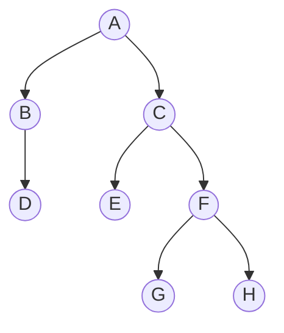

# Binærtrær og binærsøk
* strukturelt og terminologisk inspirert av slektstrær - men snudd på hodet, med roten øverst

## Terminologi
* Rotnode - det øverste leddet, har ingen foreldrenode
* Foreldre - en node som har barn (noder knyttet til seg nedover)
* Barn - en node knyttet til en forelder
* Venstre-barn - noden til venstre for en forelder
* Høyre-barn - noden til høyre for en forelder
    * Vi kaller det fremdeles venstre/høyre barn også når foreldrenoden kun har ett barn - det er plass til å legge inn den andre
* Bladnode - en node uten barn
* Indre node - noder med barn (inkl. roten)
* Nivå - rot starter på nivå 0 og så teller vi oss nedover pr "generasjon"
* Høyde - tilsvarer nivået på det laveste nivået
    * Dvs. et tre med 4 nivåer (0, 1, 2, 3) har en høyde på 3

## Kalkuler størrelsen på et tre
* Vi foretrekker indeksering fra 1 istedenfor nullindeksering - lettere formel

### Indeksering av binærtrær
* Typisk starter indekseringen på 0, på samme måte som i arrays, men:
    * Dersom vi starter indekseringen på 1 istendenfor, blir formelen for utregning av nivåer pr x elementer enda enklere

### Nivåer i et tre med x noder

### Noder i et x tre med y nivåer
* Sof: skriv opp for de ulike typene trær (hvis det er rett)

## Binærtrær - ulike typer

### Perfekt tre
* Alle nivåene i treet er fylt (det er ingen ledige plasser noe sted)

### Komplett tre
* Alle nivåer untatt det siste er helt fulle, og det siste er fylt fra venstre

### Fullt tre
* Alle nodene har enten 0 eller 2 barn (ingen har kun 1 barn)

### Degenerate/skewed tree
* Hver indre node har kun ett barn - blir tilnærmet som en LinkedList og vi mister effektiviteten i binærtreet

## Binærsøketrær
* Binærsøk: link til omplementering under søkealgoritmer
* Binærsøketre

## Implementasjon av et binærtre i Java
### Metode 1: Nodeklasse med venstre- og høyre-peker
### Metode 2: Nodene nummereres og legges i Array

## Å travsere et tre
  
Vi legger noden til i listen når vi passerer den fargen som matcher ordenen vi følger

Gitt dette treet:

### Nivåorden
* Vi går nivå for nivå, og printer fra venstre til høyre 
* Ulempe - litt mer tungvinn å implementere enn de andre metodene

* Resultat: A BC DEF GH

### Preorde
* Hver gang vi passerer den blå streken (på venstre side av node), printer vi noden
* Resultat: A B D C E F G H

### Inorder
* Hver gang vi passerer den grønne streken (på undersiden av noden), printer vi noden
* Resultat: D B A E C G F H

### Postorden
* Hver gang vi passerer den røde streken (på høyre side av noden), printer vi noden
* Resultat: D B E G H F C A

## Kilder
Bilder: https://www.geeksforgeeks.org/dsa/types-of-binary-tree/