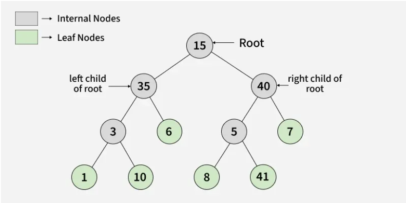
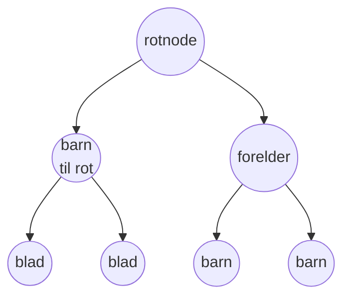
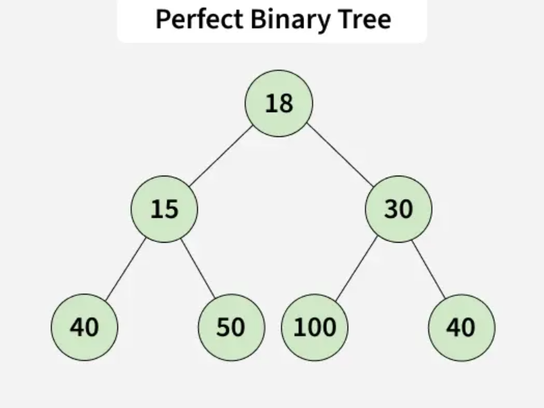
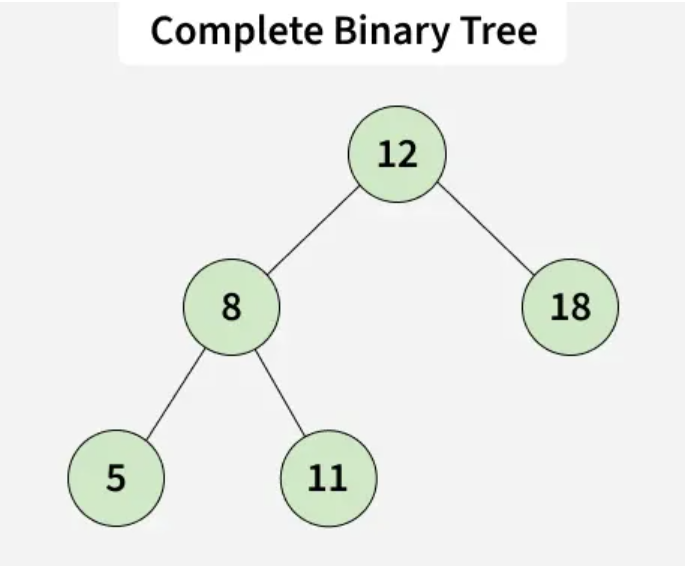
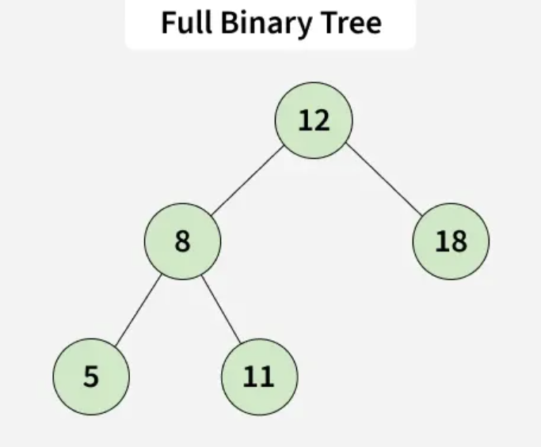
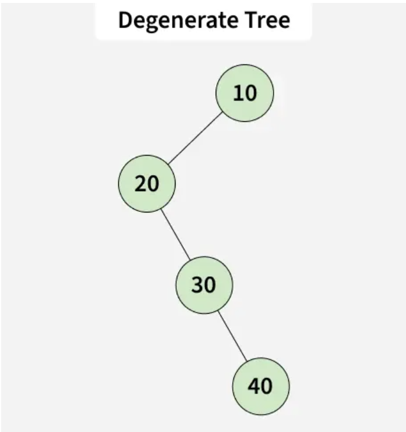
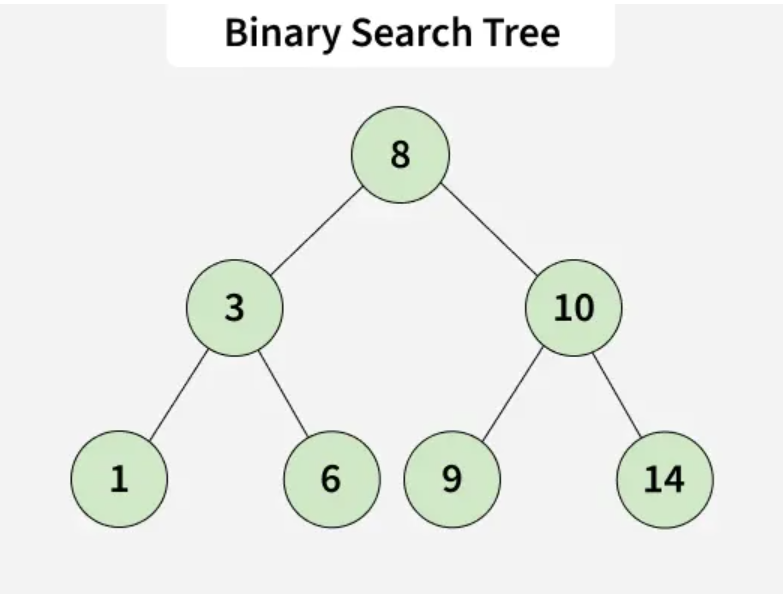

# Binærtrær og binærsøk
* strukturelt og terminologisk inspirert av slektstrær - men snudd på hodet, med roten øverst

## Terminologi
* Rotnode - det øverste leddet, har ingen foreldrenode
* Foreldre - en node som har barn (noder knyttet til seg nedover)
* Barn - en node knyttet til en forelder
* Venstre-barn - noden til venstre for en forelder
* Høyre-barn - noden til høyre for en forelder
  * Vi kaller det fremdeles venstre/høyre barn også når foreldrenoden kun har ett barn - det er plass til å legge inn den andre
* Bladnode - en node uten barn
* Indre node - noder med barn (inkl. roten)
* Nivå - rot starter på nivå 0 og så teller vi oss nedover pr "generasjon"
* Høyde - tilsvarer nivået på det laveste nivået 
  * Dvs. et tre med 4 nivåer (0, 1, 2, 3) har en høyde på 3

## Binærtrær

### Perfekt tre
* Alle nivåene i treet er fylte

### Komplett tre
* Alle nivåer untatt det siste er helt fulle, og det siste er fylt fra venstre

### Fullt tre
* Alle nodene har enten 0 eller 2 barn (ingen har kun 1 barn)

### Degenerate/skewed tree
* Hver indre node har kun ett barn - blir tilnærmet som en LinkedList og vi mister effektiviteten i binærtreet

## Binærsøketrær

### Kilder
Bilder: https://www.geeksforgeeks.org/dsa/types-of-binary-tree/

