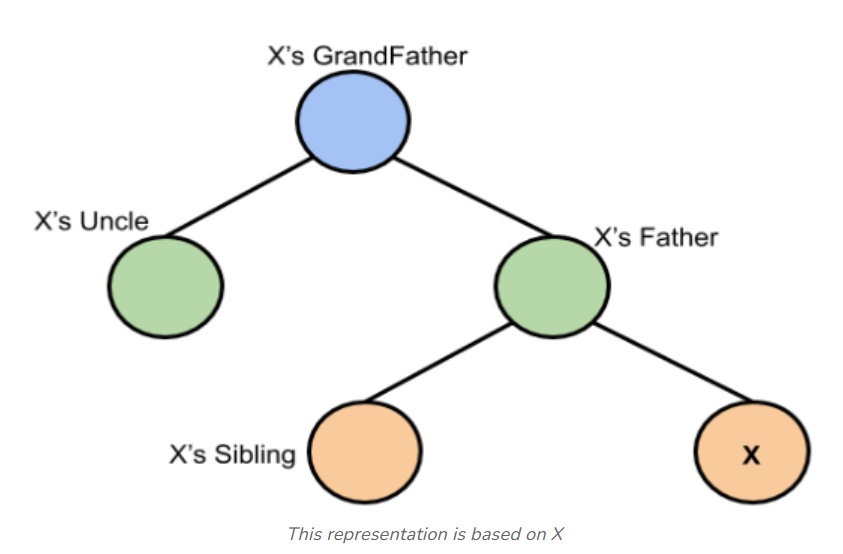
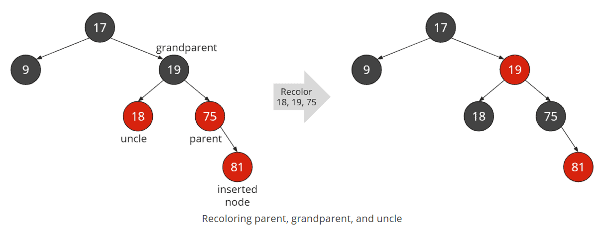
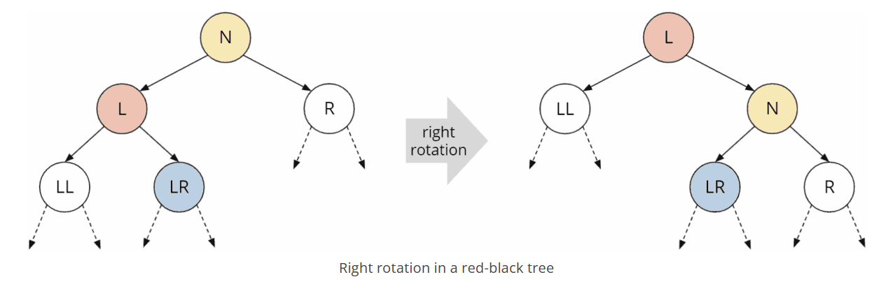
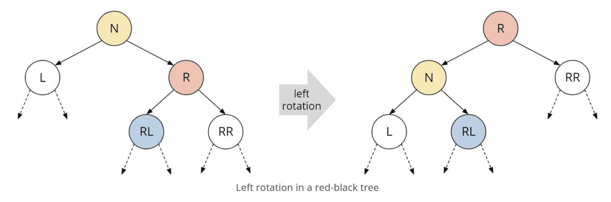
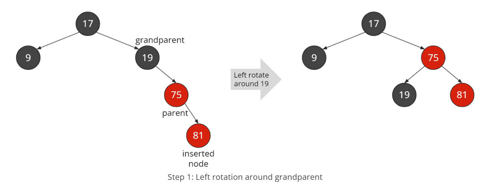
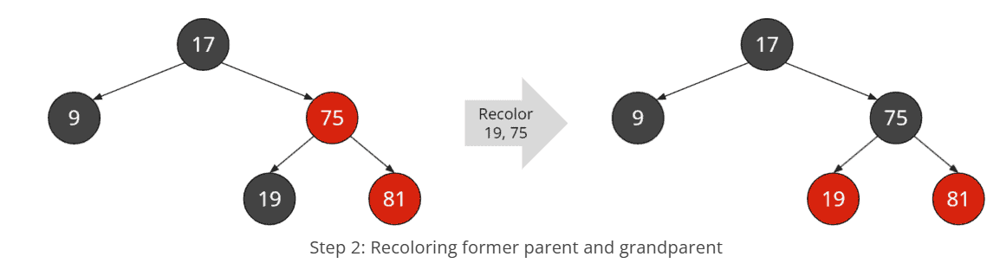
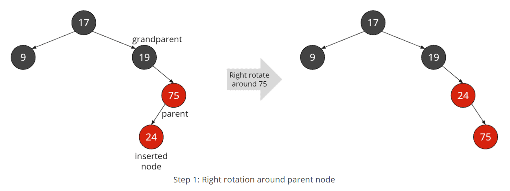
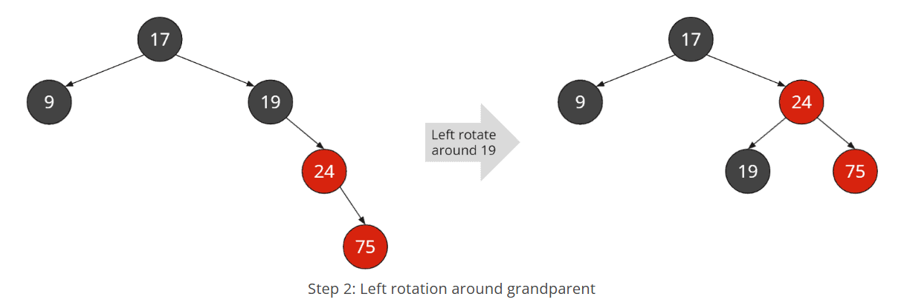
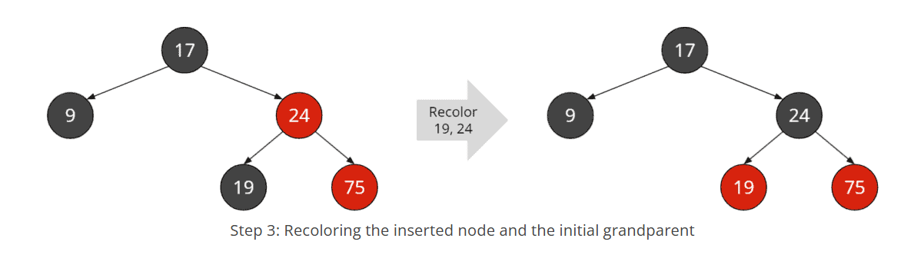

# Rødsorte trær
Et selvbalanserende binærsøketre. 
Det er ekvivalent med 2-3-4-trær mht. balansering, men altså et ekte binærtre.
2-3-4-trær er litt krevende å programmere fordi vi må oppfylle en rekke krav, særlig fjerning er litt utfordrende.

### Regler:
* Hver node er enten rød eller sort
* Rotnoden er sort - dette er standard
* NIL-noder er bladnoder med nullverdi (avbildes ofte ikke), de er alltid sorte
* En rød node kan aldri ha røde barn
* Fra rot til bladnode skal det alltid være samme antall sorte noder
  * Vi kan derfor snakke om "sort høyde"
  * Ettersom det aldri kan være 2 rød på rad, er hver vei fra rot til blad maks dobblet så lang som kortest vei

### Terminologi
**X** - den nye noden/den vi "ser" på  
**F** - forelder  
**S** - søsken (deler foreldrenode)  
**T** - tante (forelders søsken)  
**B** - besteforelder  

## To røde - og rød tante -> fargeskifte
Vi bytter farge på forelder, tante og besteforelder. Så må vi sjekke at alt er lovlig høyere opp i treet og at vi ikke har fått 2 røde ved besteforelder.
Altså er det besteforelder som nå er vår "x" node som vi må vurdere om er lovlig.
B blir rød (fra sort), og forelder og tante blir sorte, slik at X er lovlig som rød.

## To røde - ingen rød tante -> rotasjon og fargskifte
Vi må rotere Besteforelder ned mot Tanten, slik at Foreldrenoden kommer opp.
Vi bytter farge på F og B.

Vi gjør venstrerotasjon dersom X er venstrebarn av et venstrebarn.
Høyrerotasjon dersom X er høyrebarn av et høyrebarn (de ligger på linje, uten en knekk).

**Høyrerotasjon:**

**Venstrerotasjon:**

**Venstrerotasjon, med fargeskifte:**

## To røde og en knekk -> dobbel rotasjon og fargeskifte
Dersom vi tenker på rotasjon som på klokka, går vi til høyre, fra 6 til 12, og gjør en dobbel høyrerotasjon - dette er strengt tatt en venstre, og så en høyrerotasjon.
En dobbel venstrerotasjon, å gå først et steg til høyre og så et til venstre, blir som å la viseren gå bakover, fra 6 til 12 via 3.

Først roterer vi så X kommer opp og F blir dens barn (på motsatt side av det X var for F).
Så roterer vi B ned mot T slik at X kommer opp. Eventuelle barn som ikke lenger får plass som venstre/høyrebarn av X kobles på nærmeste node med plass (bevar str-forhold, BST).
Ved dobbelt rotasjon er vi opptatt av de to nodene som skal roteres - X og F, og deres barn = totalt 5 noder.

Et triks for å se underveis om rotasjonene er gjort korrekt - se at inorden ikke har endret seg!

